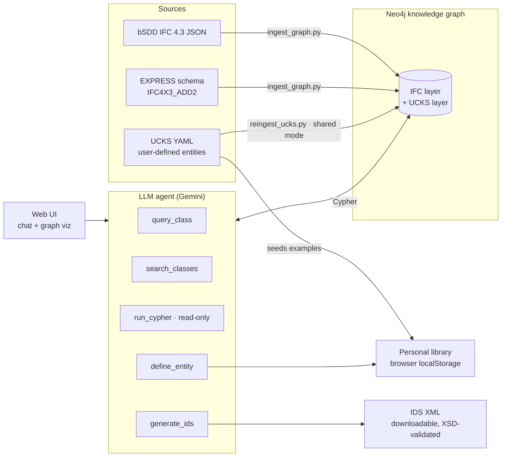

# AEC Knowledge Graph

A GraphRAG-powered knowledge engine for the built environment. It ingests the
official **IFC 4.3** schema into a **Neo4j** knowledge graph, answers
natural-language questions about it through an LLM agent grounded in graph
queries, lets domain experts define new AEC concepts in the
**UCKS knowledge schema**, and exports machine-readable
**IDS** (Information Delivery Specification) requirements.

**Live demo:** https://aec-knowledge-engine-16881077631.us-central1.run.app


## Overview and Purpose

Semantic interoperability is one of the hardest problems in digital twins for
the built environment: the IFC standard is enormous (1,400+ classes, 2,500+
properties), hard to browse, and harder to query. This project makes that
knowledge *conversational and computable*:

- The full IFC 4.3 schema — classes, property sets, properties, EXPRESS
  attributes, inheritance, enumerations — becomes a queryable knowledge graph.
- An LLM agent answers questions by **retrieving facts from the graph**
  (GraphRAG), not by guessing from training data.
- Domain experts describe new concepts in plain English; the system
  structures them into validated, versioned UCKS entities kept in a personal
  library — and can map them back to IFC and export IDS specifications.

## Key Capabilities

- **Natural-language IFC queries** — "What properties does IfcBridge need?"
  answered from live graph data, with the supporting subgraph visualized.
- **Structural queries** — EXPRESS-level attributes, inheritance chains,
  WHERE rules, enumerations, and select types.
- **Read-only Cypher analytics** — aggregations and comparisons across the
  schema ("which property sets are shared by the most classes?").
- **UCKS entity definition** — conversational capture of new AEC
  concepts into a validated YAML + graph representation. On the hosted
  demo each visitor's library is private to their browser; self-hosted
  deployments can switch to a shared Neo4j library (`UCKS_STORAGE=graph`).
- **UCKS → IFC mapping and IDS export** — generate XSD-validated
  buildingSMART IDS XML from graph knowledge.
- **Interactive graph UI** — vis.js force-directed visualization with node
  details, class search, and a three-step workflow (Define → Library → Query).

## Using the Live Demo

Open the [live demo](https://aec-knowledge-engine-16881077631.us-central1.run.app)
— no account or setup needed. The app walks you through three steps, in tab
order:

1. **Define** — describe an AEC concept in plain English (or click the
   built-in *"Define a culvert"* suggestion). The agent structures it into a
   UCKS entity with properties, relationships, and constraints, and renders
   its graph.
2. **Library** — browse your entities. Three examples come pre-loaded
   (railing, structural component, precast concrete girder). Click a card to
   see its graph, view or download its YAML, or press **Export to IFC**.
3. **Query** — ask anything about IFC 4.3 ("What properties does IfcBridge
   need?", "Compare IfcWall and IfcCurtainWall"). Exporting a library entity
   here maps it to the closest IFC class and returns a downloadable,
   XSD-validated IDS file.

Your library is private: it lives only in your browser (localStorage) —
nothing you define is shared with other visitors. The demo runs on free-tier
services, so chat is rate-limited (5 messages per minute per user).

## Role in the STC-DT Ecosystem

This repository is the **Knowledge Graph / Semantic Interoperability**
component of the Socio-Technical Cyberinfrastructure for Digital Twins
(STC-DT) umbrella. It provides the shared semantic backbone: other STC-DT
components (AI-enabled geometry generation, urban digital twin
interoperability) can resolve *what things mean* — entity definitions,
required properties, relationships, and exchange requirements — against this
graph, and exchange requirements with it via standard formats (IFC, IDS,
UCKS YAML).

## Architecture



Defined entities go to the visitor's **personal library** (browser
localStorage) by default; self-hosted deployments can set
`UCKS_STORAGE=graph` to ingest them into the shared Neo4j UCKS layer
instead.

The agent never answers from memory alone: every factual claim is retrieved
through one of its graph tools, and the `run_cypher` tool rejects all write
operations.

## Installation and Setup

### Software requirements

| Requirement | Version | Notes |
|---|---|---|
| Python | 3.10+ | |
| Neo4j | 5.x | Local Docker or [AuraDB Free](https://neo4j.com/cloud/aura-free/) |
| Google Gemini API key | — | Free tier at [aistudio.google.com/apikey](https://aistudio.google.com/apikey) |
| Docker | optional | For local Neo4j / full-stack compose |

Python dependencies (see `requirements.txt`): `neo4j`, `google-genai`,
`flask`, `pydantic`, `lxml`, `pyyaml`, `python-dotenv`, `gunicorn`.

### Steps

```bash
# 1. Clone and install
git clone https://github.com/halilyasavul/aec-knowledge-graph.git
cd aec-knowledge-graph
pip install -r requirements.txt

# 2. Start Neo4j (local option)
docker run -d --name neo4j -p 7474:7474 -p 7687:7687 \
  -e NEO4J_AUTH=neo4j/password123 neo4j:5

# 3. Configure environment
cp .env.example .env    # fill in Neo4j credentials + Gemini API key

# 4. Download the IFC schema files from buildingSMART (free account)
#    -> see data/README.md for exact instructions; not redistributed here

# 5. Build the knowledge graph (~1 minute local, a few minutes on Aura)
python -m aec_kg.ingest_graph
python -m aec_kg.reingest_ucks   # loads the bundled example UCKS entities

# 6. Run the web app
python -m aec_kg.web_app         # open http://localhost:8080
```

## Quick-Start Example

Ask a question from the CLI without the web UI:

```bash
python -m aec_kg.main_orchestrator -q "What property sets does IfcRailing require?"
```

### Example input and output

**Input** (chat or CLI):

> Define a culvert. It's a drainage structure that channels water under a
> road or railway. It has length, span or diameter, invert level, and can be
> pipe, box, or arch type, with a design flow capacity in m3/s.

**Output**: the agent structures this into a validated UCKS entity (YAML +
graph view) and saves it to your personal library. See
[data/ucks_entities/general/railing.yaml](data/ucks_entities/general/railing.yaml)
for a bundled example of the stored format, and
[examples/sample_output_railing.ids](examples/sample_output_railing.ids)
for an exported, XSD-validated IDS file.

More worked prompts: [examples/](examples/).

## Project Structure

```
aec-knowledge-graph/
  aec_kg/                  # Application package
    config.py              #   Environment configuration
    express_parser.py      #   EXPRESS (.exp) schema parser
    ingest_graph.py        #   IFC schema -> Neo4j ingestion
    reingest_ucks.py       #   Restore UCKS YAML entities into Neo4j
    neuro_agent.py         #   Neo4j query layer
    main_orchestrator.py   #   LLM agent with graph tools
    web_app.py             #   Flask server + REST API
    templates/             #   Web UI (chat + graph visualization)
    ids/                   #   IDS generation (models, serializer, XSD validator)
    ucks/                  #   UCKS models + pipeline
  data/                    # Schema files (see data/README.md) + UCKS examples
  docs/                    # Whitepaper, deployment guide, API reference
  examples/                # Worked prompts and a sample IDS output
  tests/                   # Pytest suite (no external services needed)
```

## Current Applications / Use Cases

- **IFC schema exploration** for practitioners and researchers — property
  requirements, inheritance, and cross-class comparisons without reading the
  specification.
- **Exchange-requirement authoring** — conversational generation of IDS
  specifications grounded in exact IFC property set / property names.
- **Domain knowledge capture** — structuring expert knowledge of the built
  environment (culverts, precast girders, railings) into a versioned,
  machine-readable schema (UCKS) with IFC mappings.
- **NSF PESOSE / STC-DT** — semantic backbone use case for an open-source
  digital-twin ecosystem.

## Testing and Validation

- `pytest` suite in [tests/](tests/) covering the EXPRESS parser, IDS
  generation + XSD validation, UCKS model validation, and the YAML
  round-trip. Run with `pytest`; no database or API key required.
- Continuous integration via GitHub Actions runs the suite on every push
  and pull request.
- Ingestion self-verifies: `ingest_graph.py` logs node/relationship counts
  after loading (1,418 bSDD classes, 746 property sets, 2,501 properties,
  876 EXPRESS entities).
- Every generated IDS file is validated against the official buildingSMART
  `ids.xsd` before being returned.
- Agent answers are grounded: tools return live graph data, and the Cypher
  tool is restricted to read-only queries.

## Documentation

- [docs/whitepaper.md](docs/whitepaper.md) — architecture and design rationale
- [docs/deployment.md](docs/deployment.md) — Cloud Run + AuraDB deployment guide
- [docs/universal_schema_draft.md](docs/universal_schema_draft.md) — UCKS design draft
- [data/README.md](data/README.md) — obtaining the IFC schema files

## Related Publications

None yet — publications building on this component will be listed here.

## Developers / Contributors

- **Yong-Cheol Lee, Ph.D., LEED AP, FMP** — Principal Investigator, Louisiana State University
  ([yclee@lsu.edu](mailto:yclee@lsu.edu))
- **Halil Yasavul** — design and development
  ([halil.i.yasavul@gmail.com](mailto:halil.i.yasavul@gmail.com))

Contributions welcome — see [CONTRIBUTING.md](CONTRIBUTING.md).

## License

[Apache License 2.0](LICENSE). IFC, bSDD, and IDS are standards of
[buildingSMART International](https://www.buildingsmart.org/); their schema
content is obtained directly from buildingSMART and is not redistributed
here (see [NOTICE](NOTICE)).
